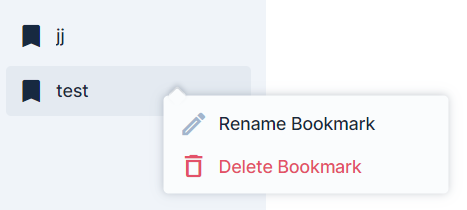
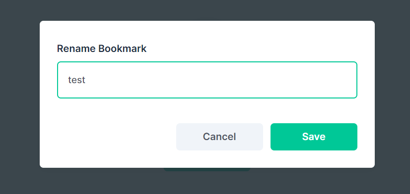

# bookmark-edit

E.g. in Collections

Activation via menu right-click (separately in navigation): 

Bookmark-edit Dialogue Popup: 

TODO - deletion should also be possible when clicking on filled bookmark item in header TODO - use 3-dot action button
on hover instead of right click
