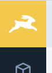

# Module Bar Logo

Logo at the top of the module bar. Renders either the rabbit (default), or the custom project logo if it exists.

It listens to the requestsStore, and makes the bunny run whenever a request is made.



## Usage

```html
<module-bar-logo />
```

## Props

n/a

## Slots

n/a

## Events

n/a

## CSS Variables

n/a
