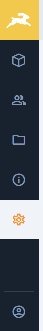

# Module bar

The left most sidebar that holds the module navigation.

Directly used by VIEW.... uses module-bar-avatar and module-bar-logo



## Usage

```html
<module-bar />
```

## Props

n/a

## Slots

n/a

## Events

n/a

## CSS Variables

n/a
